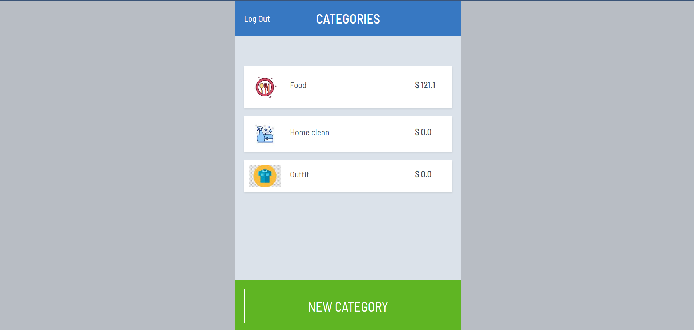

# Budget App
A mobile web application where users can manage their budget.

## Features

- The main page display a splash screen, to allow users sign in or sign up.
- The home page call *categories* display a list of all categories created by the sign in user.
- Each category card display an icon and the *total spent amount* by adding the amounts of each transaction that belongs to that category.
- User can create a new category by clicking on the green button *new category*.
- Check a category's transactions information by clicking on their card.
- Each transactions card display the date, description, and the amount corresponding to that transaction.
- User can create a new transaction by clicking on the green button *new transaction*.
- The header navigator has a *back* button. It also displays the submit button call *Next* when user open a register form like: *sign in, sign up, new category, and new transaction*

## Live demo

[Budget app demo](https://budgetappgaby.herokuapp.com/)

## Built With

- Ruby
- Ruby on Rails

## Getting Started

To get a local copy up and running follow these simple example steps.

### Prerequisites

- Have `git` installed on your local computer.
- Have `ruby` installed on your local computer.
- Have `rails` installed on your local computer.
- Have `postgresql` installed on you local computer.

### Install

- Run the commant `git clone git@github.com:gabyse1/budget-app.git` or `git clone https://github.com/gabyse1/budget-app.git` to clone this repository to your local computer. Choose the location you prefer.
- Run the command `bundle install` to install all project's dependencies.

### Usage

- Run the command `rails db:create` to create the app's database.
- Run the command `rails s` to execute the programm.
- Open the url `http://localhost:3000` on a browser.

## Authors

👤 **Gabriela Sánchez Espirilla**

- GitHub: [@gabyse1](https://github.com/gabyse1)
- LinkedIn: [gabyse](https://www.linkedin.com/in/gabyse/)
- Twitter: [@gabyse0](https://twitter.com/gabyse0)

## 🤝 Contributing

Contributions, issues, and feature requests are welcome!

Feel free to check the [issues page](../../issues/).

## Show your support

Give a ⭐️ if you like this project!

## Acknowledgments

- Original design idea: [Gregoire Vella on Behance](https://www.behance.net/gallery/19759151/Snapscan-iOs-design-and-branding?tracking_source=)
- Linters: [Microverse](https://github.com/microverseinc/linters-config)

## 📝 License

This project is [MIT](./LICENSE) licensed.
